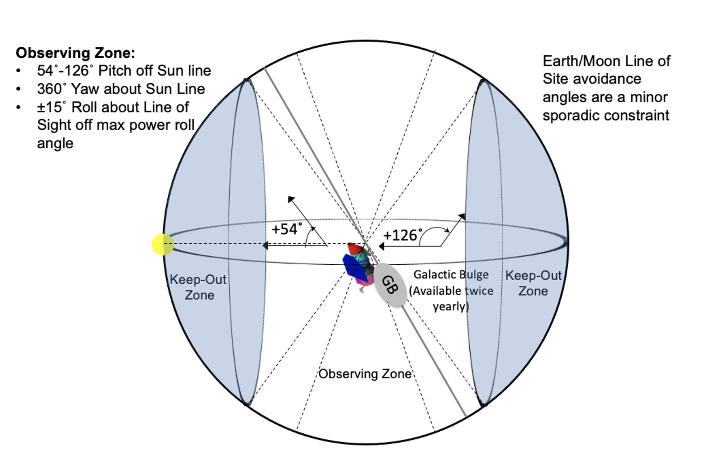
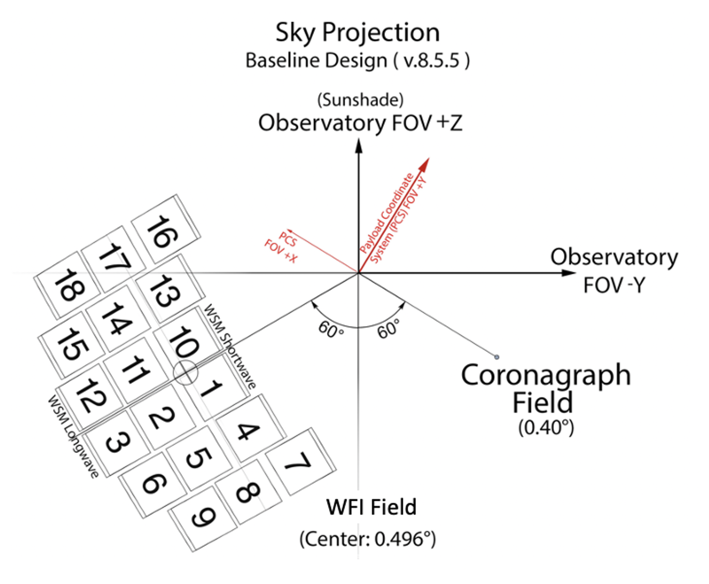
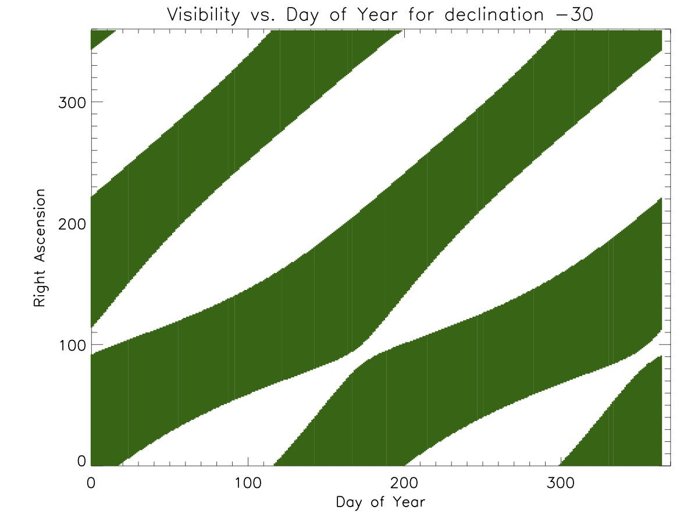
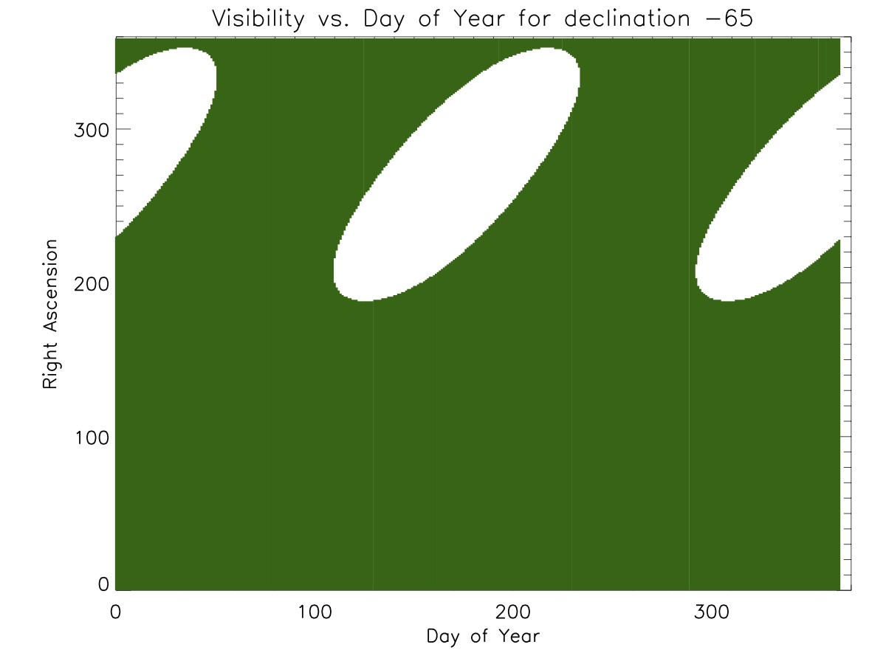

# Roman Target Visibility, Field of Regard, and Allowed Roll Angles

## Field of regard and optical field layout
The Roman field of regard and optical field layout are illustrated below. These figures provide information about the observing zones, and the angles between the detectors and the instruments.

|Roman field of regard | Optical field layout of the observatory |
|---|---|
|  |  |

## Target Visibility

A full set of visibility plots with declination increasing at intervals of 5 degrees is available. Example visibility plots for two different target declinations are provided below. The Y-axis is the R.A, and the X-axis is the day of the year. The regions in green represent where/when the line of sight is in the Roman field-of-regard.

|Visibility at Dec. = -30 deg | Visibility at Dec. = -65 deg |
|---|---|
|  |  |

## Included files

| Filename| Description|
|---------|------------|
| radec_vis.tar | Visibility plots with declination increasing at intervals of 5 deg in .eps format. | 
| Roman_Field_of_regard.png | Image showing the Roman field of regard |
| Optical_Field_Layout_of_the_observatory.png | Image showing the optical field layout of the observatory|
| roman_radec_vis_m30.jpg| Image showing the visibility at Dec. = -30 deg|
| roman_radec_vis_m65.jpg| Image showing the visibility at Dec. = -65 deg|
| test_tgt_vis2.py | Python code to explore visibility and available roll angles|